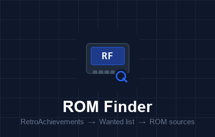
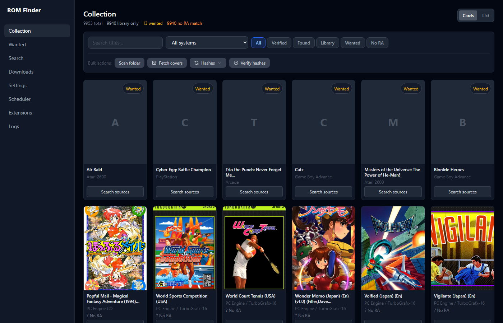
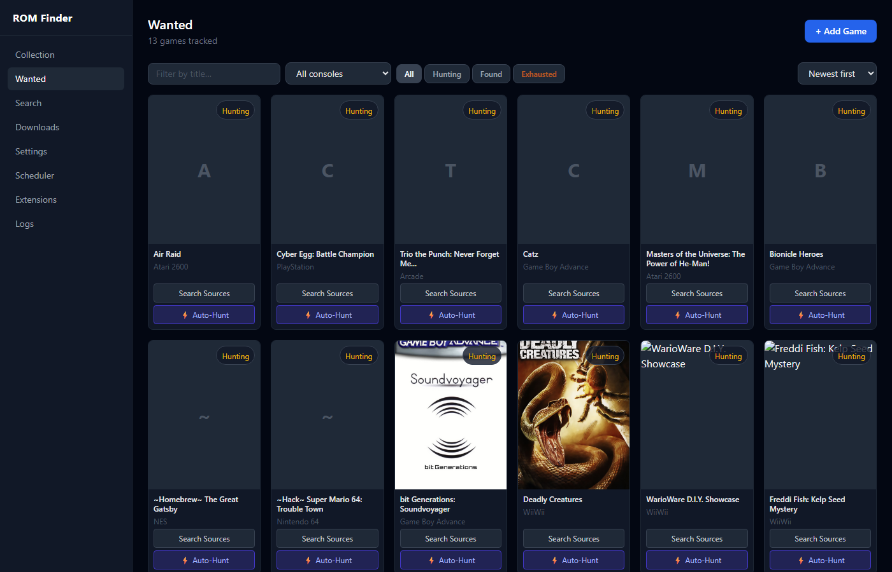
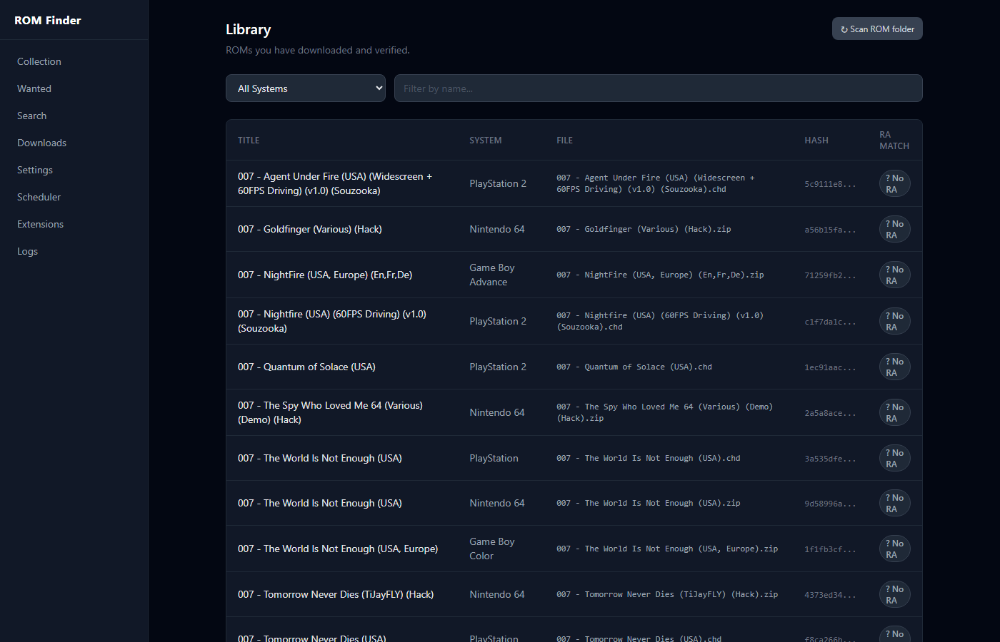
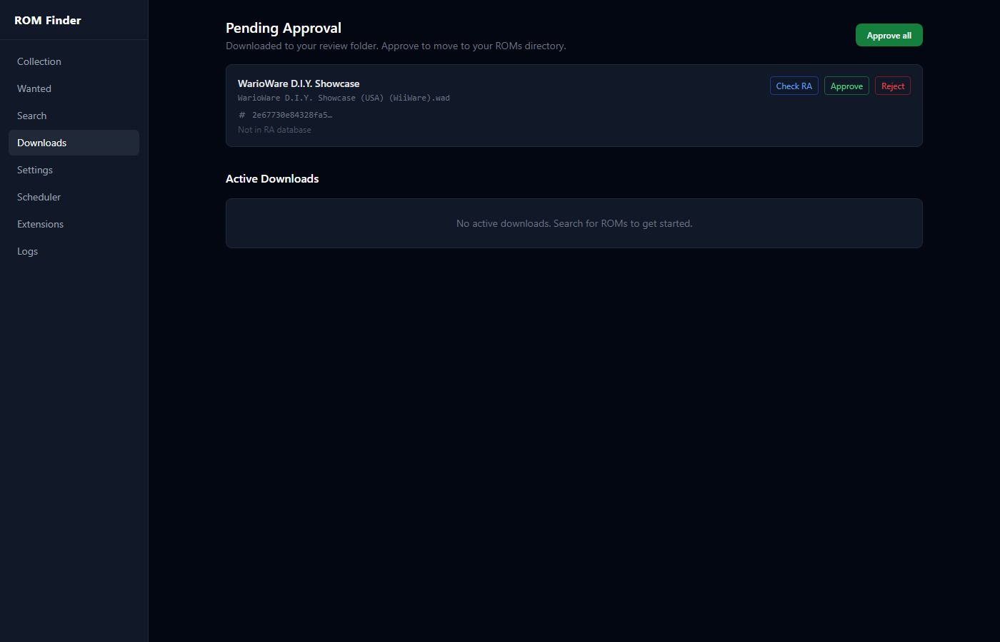
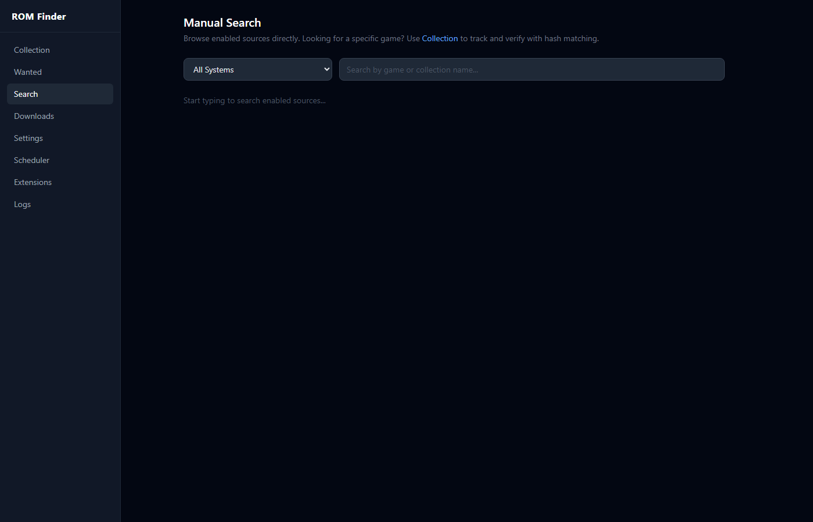
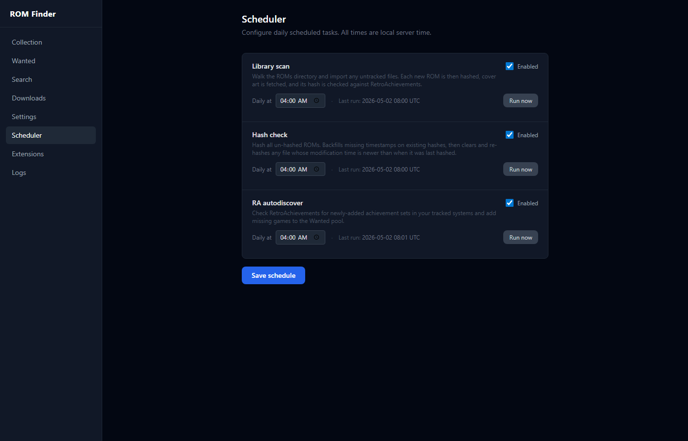
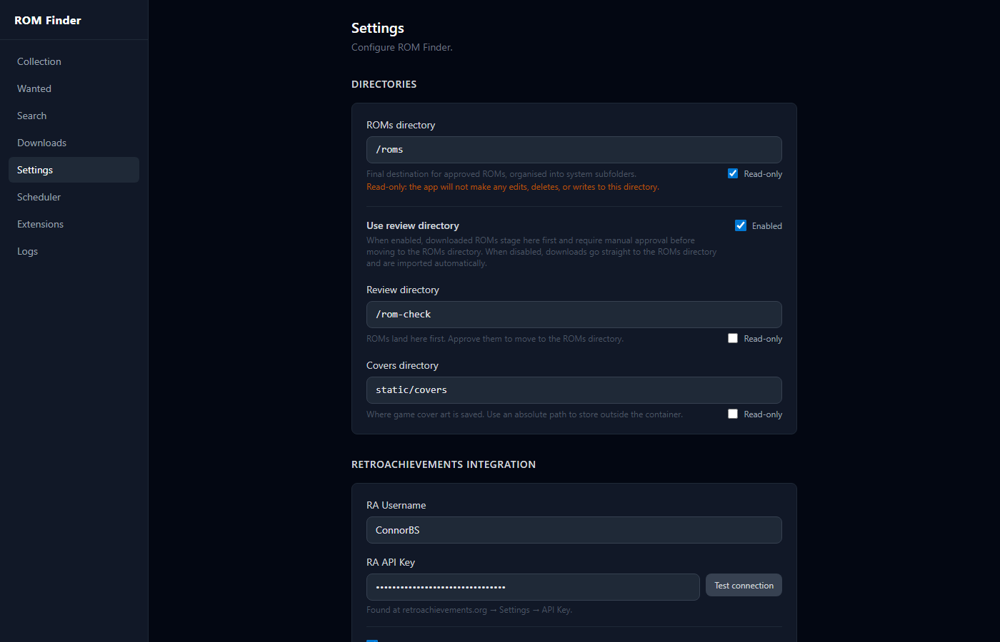
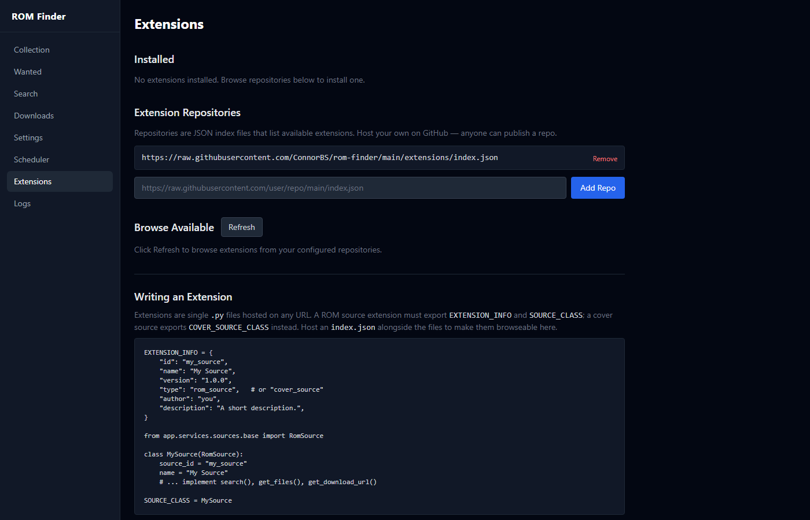
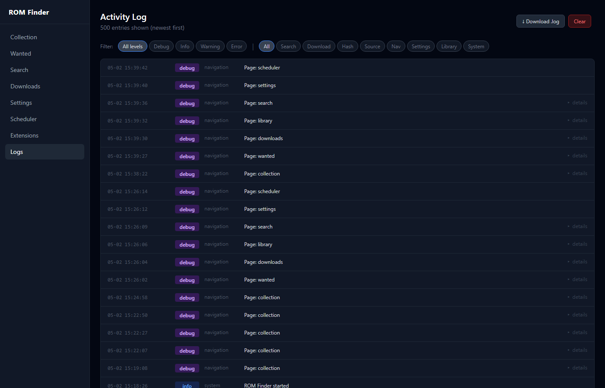

<div align="center">
  
  <br/><br/>

  <p>
    <a href="https://www.python.org/downloads/release/python-3120/"></a>
    <a href="https://fastapi.tiangolo.com/"></a>
    <a href="https://htmx.org/"></a>
    <a href="https://www.docker.com/"></a>
    <a href="https://retroachievements.org/"></a>
  </p>

  <p><strong>Self-hosted ROM collection manager with RetroAchievements hash verification.</strong><br/>
  Discover games, find dumps, verify hashes, track your library — all in one place.</p>
</div>

---

## Overview

ROM Finder is a self-hosted web application for building a **quality-first** ROM library. Every ROM that enters the collection must pass a RetroAchievements (RA) hash check — not just any dump that boots, but a verified, known-good dump that RA's achievement engine will accept.

The workflow is linear and deliberate:

```
RA game database → Wanted list → ROM sources → Download → Hash & Verify → Library
```

A companion **Chrome extension** lets you add games directly from any RetroAchievements game page. A **plugin system** lets you add new ROM sources (Vimm's Lair, ROMsFun, WowROMs) without touching core code.

---

## Features

| Category | Details |
|---|---|
| **Discovery** | Search the RetroAchievements game database; add titles to your Wanted pool |
| **Multi-source search** | Internet Archive (built-in) + Vimm's Lair, ROMsFun, WowROMs via extensions |
| **Hash verification** | Platform-aware RA hash algorithms via the official [RAHasher](https://github.com/RetroAchievements/RAHasher) binary; MD5 fallback |
| **Archive support** | `.zip` and `.7z` files extracted, largest ROM hashed, archive cleaned up |
| **Cover art** | Auto-fetched from RetroAchievements or SteamGridDB; configurable priority order |
| **Staging area** | Downloads land in a review folder for inspection before moving to the main library |
| **Scheduled tasks** | Daily library scan, hash backfill, RA autodiscover — all configurable, all have a "Run Now" button |
| **Extension system** | Install/remove ROM and cover sources from external repos via the web UI |
| **Chrome extension** | 1-click "Add to Wanted" and source search on any RA game page |
| **Activity tray** | Real-time progress sidebar that polls background tasks every 3 seconds |
| **Structured logs** | Searchable activity log (download, hash, search, system events) |

---

## Screenshots

### Collection — card grid with cover art, status badges, and bulk actions



### Wanted list — hunt status per game, inline source search, Auto-Hunt



### Library — full ROM table with system, file, hash, and RA match columns



### Downloads — pending-approval staging with Check RA / Approve / Reject per file



### Manual Search — query enabled sources directly by title and system



### Scheduler — three background tasks with configurable daily times and Run Now



### Settings — directories, RA credentials, source toggles, cover priority



### Extensions — browse and install ROM/cover sources from external repos



### Activity Log — structured log filterable by level and category



---

### Chrome Extension

Browse to any game on [retroachievements.org/game/...](https://retroachievements.org) and the ROM Finder panel appears inline:

<div align="center">
  <table>
    <tr>
      <td align="center">
        
        <br/><em>Panel appears on any RA game page</em>
      </td>
      <td align="center">
        
        <br/><em>One click to add to Wanted list</em>
      </td>
      <td align="center">
        
        <br/><em>Confirms add and shows source results</em>
      </td>
      <td align="center">
        
        <br/><em>Popup shows server connection status</em>
      </td>
    </tr>
  </table>
</div>

---

## Getting Started

### Docker (Recommended)

The fastest way to run ROM Finder is with the pre-built Docker image from GitHub Container Registry.

**1. Pull and run:**

```bash
docker run -d \
  --name rom-finder \
  --restart unless-stopped \
  -p 8080:8080 \
  -e HOST=0.0.0.0 \
  -e PORT=8080 \
  -v rom-finder-data:/data \
  -v rom-finder-covers:/app/static/covers \
  -v /path/to/your/ROMs:/roms \
  -v /path/to/your/staging:/rom-check \
  ghcr.io/connorbs/rom-finder:latest
```

Then open [http://localhost:8080](http://localhost:8080).

**2. Configure in the UI:**

Go to **Settings** and fill in:
- Your RetroAchievements **username** and **API key** (free at [retroachievements.org](https://retroachievements.org))
- The paths mapped inside the container (`/roms`, `/rom-check`)

That's it — the database is created automatically on first launch.

---

### Docker Compose

A `docker-compose.yml` is included for persistent deployments. Adjust the volume paths for your system:

```yaml
services:
  rom-finder:
    image: ghcr.io/connorbs/rom-finder:latest
    container_name: rom-finder
    restart: unless-stopped
    ports:
      - "8080:8080"
    environment:
      - HOST=0.0.0.0
      - PORT=8080
      - DEBUG=false
      - DB_URL=sqlite:////data/rom_finder.db
    volumes:
      - rom-finder-data:/data                    # SQLite database
      - rom-finder-covers:/app/static/covers     # Downloaded cover art
      - /your/ROMs:/roms                         # Main ROM library
      - /your/staging:/rom-check                 # Review/staging area

volumes:
  rom-finder-data:
  rom-finder-covers:
```

```bash
docker compose up -d
```

**Unraid users:** The included `docker-compose.yml` uses the default Unraid share layout (`/mnt/user/ROMs` and `/mnt/ssd_cache/...`). Adjust to match your pool/share names.

---

### Building from Source

```bash
git clone https://github.com/ConnorBS/rom-finder.git
cd rom-finder

python -m venv .venv
.venv\Scripts\activate          # Windows
# source .venv/bin/activate     # Linux/macOS

pip install -r requirements.txt
playwright install chromium     # Required for Vimm extension

cp .env.example .env            # Edit HOST/PORT if needed
uvicorn app.main:app --reload --host 0.0.0.0 --port 8080
```

> **RAHasher binary:** The Docker image downloads the official [RAHasher](https://github.com/RetroAchievements/RAHasher) binary automatically. For local dev on Windows/macOS, the app falls back to Python MD5 hashing — hashes will still work for most platforms but won't match RA's per-platform byte manipulation for NES, N64, etc.

---

## Configuration

All runtime settings live in the **Settings** page (`/settings`) and are stored in the SQLite database — no config file editing required after initial setup.

### Environment Variables

These are set at container launch and control infrastructure only:

| Variable | Default | Description |
|---|---|---|
| `HOST` | `0.0.0.0` | Bind address |
| `PORT` | `8080` | Listen port |
| `DEBUG` | `false` | Enable debug logging |
| `DB_URL` | `sqlite:////data/rom_finder.db` | SQLite path inside container |

### Settings UI

| Section | Settings |
|---|---|
| **Directories** | ROM library path, staging/review path, covers path; optional read-only locks |
| **RetroAchievements** | Username, API key, enable/disable RA hash verification |
| **ROM Sources** | Enable/disable each installed source |
| **Cover Sources** | Enable/disable sources; drag to reorder priority |
| **Folder Map** | Override the default `System Name → folder name` mapping |
| **Scheduler** | Enable/disable each task; set daily run time |

### Scheduler

Three background tasks run on a configurable daily schedule:

| Task | What it does |
|---|---|
| **Library Scan** | Walks the ROM directory, registers new files, hashes them, fetches covers, and runs RA verification |
| **Hash Check** | Backfills missing hashes; detects and re-hashes stale entries |
| **RA Autodiscover** | Checks RetroAchievements for new achievement sets in your tracked systems and adds them to the Wanted pool |

Every task also has a **Run Now** button on the Scheduler page — no need to wait for the scheduled time.

---

## Extensions

ROM Finder has a plugin system for adding new ROM and cover sources. Extensions are single Python files that subclass `RomSource` or `CoverSource` and are installed via the web UI.

### Installing an Extension

1. Go to **Extensions** (`/extensions`)
2. Browse the **Available** tab — extensions are fetched from the configured repository index
3. Click **Install** on the extension you want
4. Enable it in **Settings → ROM Sources**

### Available Extensions

| Extension | Type | Description |
|---|---|---|
| **Vimm's Lair** | ROM source | Downloads from [vimm.net](https://vimm.net). Uses headless Chromium (Playwright) to bypass the JS bot challenge. Enforces Vimm's one-download-at-a-time policy automatically. |
| **WowROMs** | ROM source | Searches WowROMs.com. Results vary depending on bot-protection state. |
| **ROMsFun** | ROM source | Searches ROMsFun.com. May be blocked by Cloudflare protection. |

### Writing Your Own Extension

Create a Python file with the following structure and drop it in the `extensions/` directory (or host it and register it in `index.json`):

```python
from app.services.sources.base import RomSource

EXTENSION_INFO = {
    "id": "my_source",
    "name": "My ROM Source",
    "version": "1.0.0",
    "type": "rom_source",
    "author": "you",
    "description": "Fetches ROMs from my-site.com",
}

class MySource(RomSource):
    SOURCE_ID = "my_source"
    DISPLAY_NAME = "My ROM Source"

    async def search(self, query: str, system: str) -> list[dict]:
        # Return list of result dicts: {title, identifier, url, system, source_id}
        ...

    async def get_files(self, identifier: str) -> list[dict]:
        # Return list of file dicts: {file_name, download_url, size_bytes}
        ...

    async def get_download_url(self, identifier: str, file_name: str) -> str:
        ...

SOURCE_CLASS = MySource
```

Cover sources follow the same pattern — subclass `CoverSource` and assign `COVER_SOURCE_CLASS`.

---

## Chrome Extension

The ROM Finder Chrome extension (Manifest v3) integrates directly with RetroAchievements game pages.

### Installation

The extension is not on the Chrome Web Store — install it unpacked:

1. Open `chrome://extensions/` in Chrome
2. Enable **Developer mode** (top right toggle)
3. Click **Load unpacked** and select the `rom-finder-extension/` folder
4. Click the ROM Finder icon in your toolbar and set your server URL (e.g. `http://192.168.0.100:8080`)

### Usage

- Navigate to any `https://retroachievements.org/game/...` page
- A **ROM Finder** panel appears below the game header
- Click **Add to Wanted** to add the game to your hunt list
- Click **Search** next to any source to run a search right from the RA page
- The **popup** (`Ctrl+click` the toolbar icon) shows server connection status and a link to your Wanted list

---

## Tech Stack

| Layer | Technology |
|---|---|
| **Backend** | Python 3.12, [FastAPI](https://fastapi.tiangolo.com/) (async), Uvicorn |
| **Frontend** | [Jinja2](https://jinja.palletsprojects.com/) templates, [HTMX 2](https://htmx.org/), [Tailwind CSS](https://tailwindcss.com/) (CDN) |
| **Database** | SQLite via [SQLModel](https://sqlmodel.tiangolo.com/) |
| **HTTP client** | [httpx](https://www.python-httpx.org/) (async) |
| **Hashing** | [RAHasher](https://github.com/RetroAchievements/RAHasher) binary + Python MD5 fallback |
| **Archive support** | `py7zr`, stdlib `zipfile` |
| **Browser automation** | [Playwright](https://playwright.dev/python/) + Chromium (Vimm bot bypass) |
| **Containerization** | Docker, GitHub Actions CI/CD → webhook-triggered deploy |
| **Browser extension** | Chrome Manifest v3 (content script + service worker) |

No JavaScript framework — all interactivity is HTMX. JS in templates is minimal and used only where HTMX falls short (dropdowns, card overlay polling, drag-to-reorder).

Schema changes use a lightweight `_MIGRATIONS` list in `main.py` — no Alembic or migration tooling required.

---

## Architecture

```
rom-finder/
├── app/
│   ├── main.py                 # App entry, lifespan, migrations, scheduler startup
│   ├── db/
│   │   ├── models.py           # SQLModel tables (Library, Wanted, Downloads, etc.)
│   │   └── database.py         # Engine + session dependency
│   ├── routers/                # One file per page/feature (collection, wanted, downloads…)
│   ├── services/
│   │   ├── ra_client.py        # RetroAchievements API wrapper
│   │   ├── rahasher.py         # Platform-aware RA hash computation
│   │   ├── scheduler.py        # Background task runners + loop
│   │   ├── activity.py         # In-memory task tracker (drives live progress UI)
│   │   ├── sources/            # ROM source plugin registry + built-in Archive.org source
│   │   └── cover_sources/      # Cover source plugin registry + RA and SteamGridDB sources
│   └── templates/              # Jinja2 templates + HTMX partials
├── extensions/                 # User-installable extension files + index.json
├── rom-finder-extension/       # Chrome extension (Manifest v3)
├── Dockerfile
└── docker-compose.yml
```

**Key design decisions:**

- **No JS framework.** HTMX handles all partial updates (search results, download status, activity tray) via server-rendered HTML fragments. The only client-side JS is for things HTMX cannot express: drag-to-reorder, polling card states, mobile nav toggle.
- **Plugin registry.** ROM sources and cover sources are registered by ID at startup. Extensions call `registry.register()` — routers and services never import source classes directly.
- **Activity store.** An in-memory task tracker (`services/activity.py`) is polled by the sidebar tray (3s) and collection page (2s) to render live progress overlays without WebSockets.
- **No Alembic.** Schema evolution is handled by a `_MIGRATIONS` list of `(table, column, type, default)` tuples run at startup. SQLite's `ALTER TABLE … ADD COLUMN` makes this sufficient for the project's scale.

---

## CI/CD

Pushes to `main` trigger a GitHub Actions workflow that builds and pushes the Docker image to GHCR (`ghcr.io/connorbs/rom-finder:latest`), then fires a webhook to the Unraid host. The host pulls the new image and restarts the container — zero-downtime deploys in under two minutes.

```
git push origin main
  └─► GitHub Actions: docker build + push → ghcr.io/connorbs/rom-finder:latest
        └─► Webhook → Unraid: docker pull + restart
```

---

## Development

```bash
# Run with auto-reload
uvicorn app.main:app --reload --host 0.0.0.0 --port 8080

# The database is auto-created at startup (no migrate step)
# Settings are seeded from DEFAULT_SETTINGS in main.py on first launch
```

**Adding a new ROM source:**
1. Subclass `RomSource` → `app/services/sources/`
2. Register in `app/services/sources/registry.py`
3. Add a `source_{id}_enabled` key to `DEFAULT_SETTINGS` in `main.py`

**Adding a new DB column:**
Add a tuple to `_MIGRATIONS` in `main.py`:
```python
_MIGRATIONS = [
    # ...existing entries...
    ("library", "new_column", "TEXT", "''"),
]
```

The column is added at next startup. No migration commands, no Alembic config.
